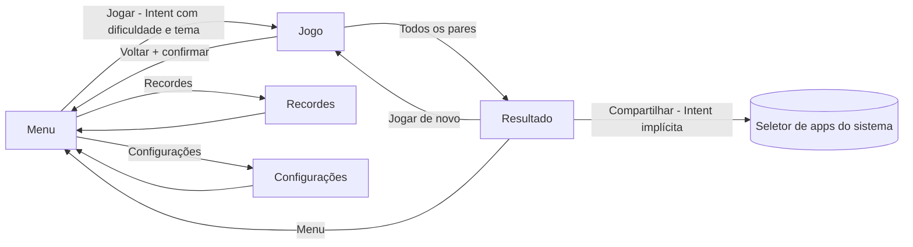

# 03 – Design e usabilidade

## 1. Princípios de design

1. **Clareza:** uma ação principal por tela, com botão de destaque.
2. **Feedback imediato:** todo toque produz resposta visual (e, se ativado, tátil).
3. **Baixa carga cognitiva:** poucos elementos, textos curtos, ícones conhecidos.
4. **Consistência:** Material Design 3, mesmos componentes e espaçamentos em todas as telas.
5. **Inclusão:** funciona para crianças e idosos, com claro/escuro, e sem depender só de cor.

## 2. Mapa de telas

| Tela | Classe | Função |
|---|---|---|
| Menu | `MainActivity` | Escolher dificuldade e tema, iniciar jogo, acessar Recordes e Configurações |
| Jogo | `GameActivity` | Tabuleiro, jogadas, cronômetro, pausar/reiniciar |
| Resultado | `ResultActivity` | Resumo da partida, estrelas, jogar de novo, compartilhar |
| Recordes | `RecordsActivity` | Top 5 por dificuldade |
| Configurações | `SettingsActivity` | Vibração e tema do app |

## 3. Fluxo de navegação



## 4. Wireframes

### 4.1 Menu

```
+----------------------------------+
|                                  |
|        JOGO DA MEMÓRIA           |
|        [ ícone do app ]          |
|                                  |
|  Dificuldade                     |
|  (•) Fácil  ( ) Médio  ( ) Difícil|
|                                  |
|  Tema                            |
|  [🐶 Animais] [🍎 Frutas] [🚗 Transp.]|
|                                  |
|  +----------------------------+  |
|  |          JOGAR             |  |
|  +----------------------------+  |
|  [ 🏆 Recordes ] [ ⚙ Config. ]   |
+----------------------------------+
```

- Dificuldade e tema: `ChipGroup` de seleção única. A última escolha é lembrada.
- **Jogar** é o botão maior e preenchido. Os outros dois são secundários.

### 4.2 Jogo

```
+----------------------------------+
| ←  Médio · Animais     ⏸   ⟳    |
|----------------------------------|
|  Jogadas: 7        Tempo: 00:42  |
|                                  |
|   +----+ +----+ +----+ +----+    |
|   | ?? | | 🐶 | | ?? | | ?? |    |
|   +----+ +----+ +----+ +----+    |
|   +----+ +----+ +----+ +----+    |
|   | ?? | | ?? | | 🐱 | | 🐱 |    |
|   +----+ +----+ +----+ +----+    |
|   +----+ +----+ +----+ +----+    |
|   | ?? | | ?? | | ?? | | ?? |    |
|   +----+ +----+ +----+ +----+    |
|   +----+ +----+ +----+ +----+    |
|   | ?? | | ?? | | ?? | | ?? |    |
|   +----+ +----+ +----+ +----+    |
+----------------------------------+
```

- Barra superior: voltar, título (dificuldade · tema), **Pausar** (⏸) e **Reiniciar** (⟳).
- Tabuleiro em `RecyclerView` com `GridLayoutManager`. As cartas se ajustam ao espaço disponível.
- **Pausado:** o tabuleiro é coberto por uma camada com o botão "Continuar".

### 4.3 Resultado

```
+----------------------------------+
|        🎉 Parabéns!              |
|        ★ ★ ★                     |
|                                  |
|   Jogadas: 11     Tempo: 01:05   |
|   🏅 Novo recorde!                |
|                                  |
|  [ Jogar de novo ]               |
|  [ Compartilhar  ]               |
|  [ Menu          ]               |
+----------------------------------+
```

### 4.4 Recordes

```
+----------------------------------+
| ←  Recordes              🗑       |
|  [ Fácil | Médio | Difícil ]     |
|----------------------------------|
|  1º   9 jogadas   00:38  18/09   |
|  2º  11 jogadas   00:52  17/09   |
|  3º  13 jogadas   01:10  15/09   |
|  ...                             |
|  (sem registros: "Jogue uma      |
|   partida para aparecer aqui")   |
+----------------------------------+
```

- Abas (`TabLayout`) por dificuldade. Lista em `RecyclerView`. Ícone de lixeira limpa os recordes, com confirmação.
- **Estado vazio** com mensagem amigável.

### 4.5 Configurações

```
+----------------------------------+
| ←  Configurações                 |
|  Vibração ao virar cartas  [ON ] |
|  Tema do app                     |
|    (•) Seguir o sistema          |
|    ( ) Claro                     |
|    ( ) Escuro                    |
+----------------------------------+
```

## 5. Identidade visual

### 5.1 Paleta (proposta)

| Papel | Claro | Escuro | Uso |
|---|---|---|---|
| Primária | `#5B3FD9` | `#B7A6FF` | Botões principais, verso das cartas, barra superior |
| Sobre a primária | `#FFFFFF` | `#1E1147` | Texto e ícones sobre a cor primária |
| Fundo | `#F6F4FF` | `#121212` | Fundo das telas |
| Superfície | `#FFFFFF` | `#1E1E24` | Cartões e diálogos |
| Acerto | `#2E7D32` | `#81C784` | Par encontrado |
| Erro | `#C62828` | `#EF9A9A` | Par errado (piscada breve) |
| Destaque (estrelas) | `#FFB300` | `#FFCA28` | Estrelas e recorde |

Contraste calculado: `#5B3FD9` com branco ≈ 6,6:1, acima do mínimo AA de 4,5:1. As demais combinações devem ser conferidas com uma ferramenta de contraste na fase de implementação (registrar no [checklist](09-checklist-de-entrega.md)).

### 5.2 Tipografia e espaçamento

- Fonte padrão do sistema (Roboto), estilos do Material 3: título (24 sp), rótulo (16 sp), corpo (14 sp).
- Múltiplos de 8 dp para espaçamento; margem lateral de 16 dp; cantos de 12 dp nas cartas.
- Tamanhos em `sp` para texto (respeita a fonte do sistema) e `dp` para o resto.

### 5.3 Cartas

- **Verso:** cor primária com padrão simples (ponto de interrogação ou losango) em vetor (`VectorDrawable`).
- **Face:** um símbolo grande (emoji Unicode) centralizado em um cartão claro.
- Símbolos por tema (12 por tema, o suficiente para o nível Difícil):
  - **Animais:** 🐶 🐱 🦊 🐼 🐸 🐵 🦁 🐯 🐙 🦉 🐢 🐝
  - **Frutas:** 🍎 🍌 🍇 🍓 🍉 🍍 🥝 🍒 🍑 🥥 🍋 🍐
  - **Transportes:** 🚗 🚕 🚌 🚀 ✈️ 🚲 🚂 🛵 🚁 ⛵ 🚜 🏍️

> Os emojis dependem da fonte do aparelho e podem ter aparência diferente entre fabricantes. Se o grupo quiser aparência idêntica em todos os aparelhos, pode trocar por `VectorDrawable` próprios (basta alterar o modelo de `Carta`, sem mudar a lógica).

### 5.4 Ícone do app

Cartas sobrepostas ou um par de cartas, com fundo na cor primária, em ícone adaptativo (`mipmap-anydpi-v26`). O grupo deve criar o ícone por conta própria, sem imagens de terceiros.

## 6. Experiência do usuário

### 6.1 Feedback visual e tátil

| Evento | Feedback |
|---|---|
| Toque em carta | Giro no eixo Y (~250 ms) revelando a face |
| Par encontrado | Cartas ficam com borda verde e leve "pulso" (escala 1,0 → 1,1 → 1,0) |
| Par errado | Borda vermelha por ~300 ms e depois as duas cartas viram de volta |
| Toque durante a comparação | Ignorado sem efeito (sem travar a interface) |
| Fim da partida | Transição para a tela de Resultado; estrelas aparecem em sequência |
| Novo recorde | Selo "🏅 Novo recorde!" em destaque |
| Vibração (se ligada) | Toque curto ao virar; toque duplo ao errar |

### 6.2 Desempenho percebido

- Nenhum carregamento pesado: o tabuleiro é gerado em memória, em poucos milissegundos.
- Animações com `ObjectAnimator` (aceleradas por hardware). A comparação usa `delay` assíncrono, sem bloquear a interface.
- Sem tela de abertura (splash) desnecessária: o app abre direto no Menu.

### 6.3 Adaptabilidade

- Layouts com `ConstraintLayout`; o tabuleiro calcula o tamanho das cartas conforme a tela.
- **Vertical:** colunas = 3 (Fácil), 4 (Médio), 4 (Difícil).
- **Horizontal:** mais colunas e menos linhas (ex.: Difícil = 6 colunas × 4 linhas). Usar `layout-land/` ou `spanCount` calculado.
- Modo escuro por `DayNight` e cores em `values-night/`.
- Sem tamanhos fixos em pixels; `dimens.xml` com variações para telas grandes (`sw600dp`).

### 6.4 Acessibilidade

- `contentDescription` nas cartas: "Carta 5, virada para baixo" / "Carta 5, cachorro" / "Carta 5, par encontrado".
- Alvos de toque ≥ 48 dp; texto que respeita o tamanho de fonte do sistema.
- Erro e acerto também aparecem por borda e ícone, e não apenas por cor.
- Compatível com TalkBack (ordem de leitura lógica: barra superior → contadores → cartas).

### 6.5 Tratamento de erros e casos extremos (visíveis ao usuário)

| Situação | Comportamento |
|---|---|
| Sem recordes | Mensagem de estado vazio |
| Dados salvos ilegíveis | O app ignora o dado corrompido, começa com a lista vazia e não fecha |
| Nenhum app para compartilhar | Aviso curto (`Snackbar`): "Nenhum aplicativo disponível para compartilhar" |
| Voltar durante o jogo | Diálogo de confirmação |
| App vai para segundo plano | Partida entra em pausa automática |
