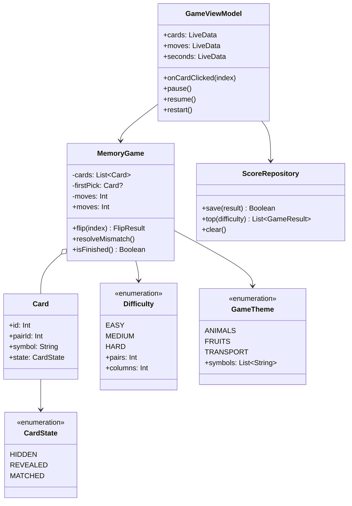
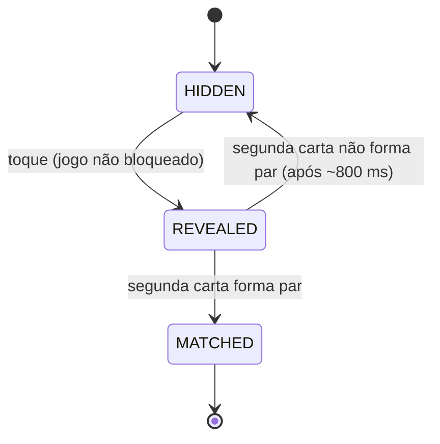

# 04 – Arquitetura e implementação

## 1. Visão geral técnica

| Item | Decisão |
|---|---|
| Linguagem | Kotlin |
| IDE | Android Studio |
| UI | Views em XML + ViewBinding (habilita `RecyclerView`, `Intent` e menus como pede o enunciado) |
| Arquitetura | MVVM simplificada: `Activity` (View) → `ViewModel` → classes de domínio |
| SDK mínimo / alvo | `minSdk 24`; `compileSdk`/`targetSdk` na versão estável mais recente do Android Studio do grupo |
| Assíncrono | Corrotinas (`viewModelScope`) para cronômetro e atraso de comparação |
| Estado observável | `LiveData` |
| Persistência | `SharedPreferences` (arquivo interno; sem banco) |
| Bibliotecas | AndroidX (AppCompat, ConstraintLayout, RecyclerView, Lifecycle), Material Components e Kotlin Coroutines |
| Testes | JUnit 4 (unitários), `kotlinx-coroutines-test` e Espresso (opcional) |
| Permissões | Nenhuma |

> Pacote-base sugerido: `com.example.jogodamemoria`. O grupo pode trocar o nome do pacote ao criar o projeto.

## 2. Organização do código

```
app/src/main/java/com/example/jogodamemoria/
├── ui/
│   ├── menu/        MainActivity
│   ├── game/        GameActivity, GameViewModel, CardAdapter
│   ├── result/      ResultActivity
│   ├── records/     RecordsActivity, RecordsAdapter
│   └── settings/    SettingsActivity
├── domain/
│   ├── model/       Card, CardState, Difficulty, GameTheme, GameResult
│   ├── MemoryGame   (regras do jogo, sem dependência do Android)
│   └── StarRating   (cálculo de estrelas – RN05)
├── data/
│   ├── ScoreRepository      (recordes)
│   └── SettingsRepository   (preferências)
└── util/            Constantes (chaves de Intent), formatação de tempo
```

**Por que assim (qualidade de código, 25% da nota):**

- `domain/` não importa nada do Android. Por isso a lógica do jogo pode ser testada rapidamente com JUnit, sem emulador.
- `ui/` só exibe e captura eventos. Não decide regras.
- `data/` esconde `SharedPreferences` atrás de classes próprias; se o armazenamento mudar, só essa camada muda.
- Cada `Activity` tem uma única responsabilidade (SRP).

### 2.1 Diagrama de classes (simplificado)



### 2.2 Estados de uma carta



## 3. Lógica do jogo (`MemoryGame`)

### 3.1 Criação do tabuleiro

1. Pega os primeiros `difficulty.pairs` símbolos do tema.
2. Duplica cada símbolo (gera 2 cartas com o mesmo `pairId`).
3. Embaralha a lista com `shuffled()`.
4. Todas as cartas começam em `HIDDEN`.

### 3.2 Regra de virar carta (`flip(index)`)

```
se o jogo está bloqueado (comparando)          → ignora
se carta.state != HIDDEN                       → ignora            (RN08)
carta.state = REVEALED

se não há primeira escolhida:
    firstPick = carta                          → retorna FIRST_REVEALED
senão:
    moves++                                    (RN02)
    se carta.pairId == firstPick.pairId:
        ambas = MATCHED; firstPick = null
        se todas MATCHED → retorna FINISHED
        senão            → retorna MATCH
    senão:
        bloqueia o jogo; guarda o par errado   → retorna MISMATCH
```

Quando o resultado é `MISMATCH`, o `GameViewModel` espera ~800 ms (`delay`) e chama `resolveMismatch()`, que volta as duas cartas para `HIDDEN` e desbloqueia o jogo.

### 3.3 Cronômetro

- Iniciado na primeira carta virada (RN03). Uma corrotina no `viewModelScope` incrementa `seconds` a cada 1 s.
- `pause()` cancela a corrotina; `resume()` a reinicia (RN04).
- O `ViewModel` sobrevive à rotação de tela; o cronômetro continua ou é retomado sem perder o valor (RF17).

### 3.4 Cálculo de estrelas (`StarRating`)

Função pura: `stars(moves, pairs)` → 1, 2 ou 3, conforme RN05. É a função mais fácil de testar e tem casos limite (ex.: `moves = 1,5·n` exatamente).

## 4. Recursos do Android SDK utilizados

O enunciado pede o uso de recursos como `Intent` e `ListView`/`RecyclerView`, à escolha do grupo.

| Recurso | Onde é usado | Por quê |
|---|---|---|
| **Activity** (5) | Cada tela | Navegação clara e ciclo de vida separado por tela |
| **Intent explícita** com *extras* | Menu → Jogo (dificuldade, tema); Jogo → Resultado (jogadas, tempo, estrelas) | Passagem de dados entre telas |
| **Intent implícita** (`ACTION_SEND`) | Compartilhar resultado | Integra com apps do sistema, sem permissão |
| **RecyclerView + GridLayoutManager** | Tabuleiro de cartas | Grade eficiente e adaptável (`spanCount`) |
| **RecyclerView + LinearLayoutManager** | Lista de recordes | Lista rolável reutilizando views |
| **ViewModel + LiveData** | Estado da partida | Sobrevive à rotação; separa UI de regras |
| **Corrotinas** | Cronômetro e atraso de 800 ms | Sem bloquear a thread principal |
| **SharedPreferences** | Recordes e configurações | Persistência simples, sem banco |
| **Animações** (`ObjectAnimator`) | Giro da carta, pulso do par, estrelas | Feedback visual |
| **Menu da barra superior** (`MaterialToolbar` + `onCreateOptionsMenu`) | Pausar, Reiniciar | Ações de contexto |
| **AlertDialog / MaterialAlertDialog** | Confirmar sair, reiniciar, limpar recordes | Evita ações acidentais |
| **Snackbar** | Avisos curtos | Feedback não intrusivo |
| **ChipGroup, TabLayout, Switch, RadioGroup** | Menu, Recordes, Configurações | Seleção de opções |
| **Recursos (`res/`)** | Strings, cores, dimensões, estilos, `values-night`, `layout-land` | i18n, modo escuro, adaptabilidade |
| **Ciclo de vida** (`onPause`/`onResume`) | Pausar ao ir para segundo plano | Justiça e economia de bateria |
| **Retorno tátil** (`performHapticFeedback`) | Virar carta, errar | Feedback sem permissão de vibração |
| **OnBackPressedDispatcher** | Confirmar saída da partida | Padrão atual de tratamento do botão "voltar" |

### 4.1 Contrato das Intents

| Origem → Destino | Chave | Tipo | Valores |
|---|---|---|---|
| Menu → Jogo | `EXTRA_DIFFICULTY` | `String` | `EASY`, `MEDIUM`, `HARD` |
| Menu → Jogo | `EXTRA_THEME` | `String` | `ANIMALS`, `FRUITS`, `TRANSPORT` |
| Jogo → Resultado | `EXTRA_MOVES` | `Int` | ≥ 1 |
| Jogo → Resultado | `EXTRA_SECONDS` | `Int` | ≥ 0 |
| Jogo → Resultado | `EXTRA_STARS` | `Int` | 1 a 3 |
| Jogo → Resultado | `EXTRA_DIFFICULTY`, `EXTRA_THEME` | `String` | como acima |
| Jogo → Resultado | `EXTRA_NEW_RECORD` | `Boolean` | — |

As chaves ficam como constantes em `util/Extras.kt`, sem *strings* soltas nas telas.

## 5. Persistência de dados

O enunciado deixa a persistência como opcional e sem banco de dados. Este projeto usa `SharedPreferences`, um arquivo interno privado do app.

| Arquivo | Conteúdo | Formato |
|---|---|---|
| `settings` | `haptics` (Boolean), `theme_mode` (Int) | Pares chave/valor |
| `scores` | Lista dos 5 melhores por dificuldade | JSON em texto (via `org.json`, já incluso no Android) |
| `menu_prefs` | Última dificuldade e tema escolhidos | Pares chave/valor |

Exemplo de conteúdo salvo em `scores` (chave `scores_MEDIUM`):

```json
[
  {"moves": 11, "seconds": 52, "stars": 3, "date": "2026-09-18"},
  {"moves": 13, "seconds": 70, "stars": 2, "date": "2026-09-17"}
]
```

- `ScoreRepository.save()` insere, ordena (RN06), corta em 5 (RN07) e devolve se o resultado entrou no ranking. É o que aciona o "Novo recorde".
- Se o JSON estiver corrompido, o repositório trata a exceção e devolve lista vazia.

## 6. Tratamento de eventos

| Evento | Origem | Tratamento |
|---|---|---|
| Clique em carta | `CardAdapter` (`onClick` → *lambda*) | `GameViewModel.onCardClicked(position)` |
| Clique em **Jogar** | `MainActivity` (`setOnClickListener`) | Monta a `Intent` com os *extras* e chama `startActivity` |
| Seleção de dificuldade/tema | `ChipGroup.setOnCheckedStateChangeListener` | Atualiza a escolha e salva em `menu_prefs` |
| Item de menu (Pausar, Reiniciar) | `onOptionsItemSelected` | `pause()` ou diálogo de confirmação + `restart()` |
| Botão voltar | `OnBackPressedCallback` | Diálogo "Sair da partida?" |
| Fim da partida | `LiveData` observado na `GameActivity` | Salva o recorde, monta a `Intent` e abre o Resultado |
| Clique em **Compartilhar** | `ResultActivity` | `Intent.ACTION_SEND` + `createChooser` |
| Troca de aba (Recordes) | `TabLayout.OnTabSelectedListener` | Recarrega a lista |
| Troca de configuração | `Switch`/`RadioGroup` listeners | Salva e aplica na hora (`AppCompatDelegate.setDefaultNightMode`) |
| App em segundo plano | `onPause` | `viewModel.pause()` |
| Rotação de tela | Sistema | `ViewModel` preserva o estado; a `Activity` só redesenha |

## 7. Decisões técnicas registradas

| Nº | Decisão | Alternativa considerada | Motivo |
|---|---|---|---|
| D1 | Views/XML com ViewBinding | Jetpack Compose | O enunciado cita `Intent` e `RecyclerView`; Views deixam esses recursos evidentes |
| D2 | `LiveData` | `StateFlow` | Menos código de ciclo de vida para o escopo do trabalho |
| D3 | `SharedPreferences` + JSON | Room/SQLite | O enunciado pede sem banco de dados |
| D4 | Emojis como face das cartas | Imagens próprias | Zero arquivos de imagem e sem risco de direitos autorais; pode ser trocado depois |
| D5 | Regras em classe pura (`MemoryGame`) | Regras dentro da `Activity` | Testabilidade e qualidade de código |
| D6 | 5 telas com `Activity` | 1 `Activity` + Fragments | Demonstra `Intent` de forma explícita |
| D7 | Estrelas por jogadas, não por tempo | Nota por tempo | Não penaliza quem joga com calma (público infantil e idoso) |

## 8. Como compilar e executar (após a implementação)

1. Abrir a pasta do projeto no Android Studio e aguardar o *Gradle Sync*.
2. Selecionar um emulador (API 24+) ou um aparelho com depuração USB.
3. Executar `Run > Run 'app'`.
4. Para os testes unitários: `Run > Run Tests` na pasta `test`, ou `./gradlew test` no terminal.
5. Para gerar o APK de depuração: `./gradlew assembleDebug`. O arquivo sai em `app/build/outputs/apk/debug/`.
